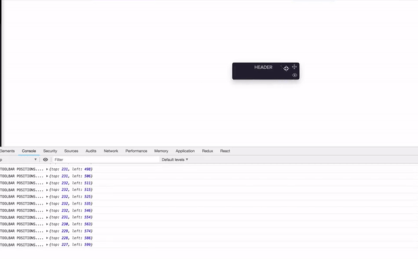

# react-drag-element
react-drag-element provides a very simple way to make any react component draggable or floating on the screen. It also calculates top and left positions for draggable component.

# Installation
`npm install react-drag-element`

# Sample

# Quick Start

```
import CustomDrag from 'react-drag-element';


getFloatingComponentPosition = (positions) => {
        console.log("FLOATING COMPONENT POSITIONS....", positions);
}

render{

    return(
          <CustomDrag
                getPositions={this.getFloatingComponentPosition}
                dragItemId={'floating-component-id'}
                dragId={'draggable-area-id'}
            >
          <div id="floating-component-id"
            <div id="draggable-area-id">
            Header
            </div>
          </div>
         );
}

</CustomDrag>
```
